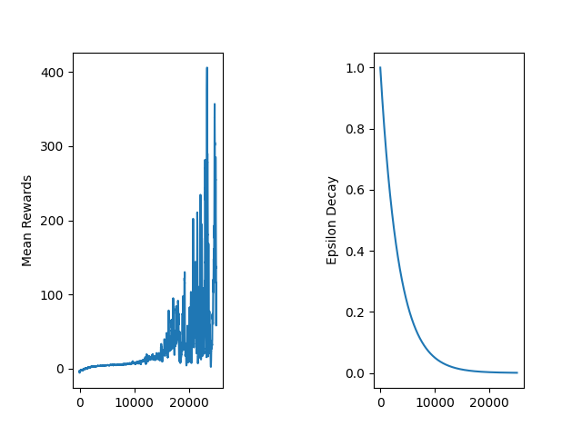

# Deep Q-Learning Agent for Flappy Bird

This project was created by [Alexandru Frunză](https://github.com/alexfrunza) and [Vlad Ștefan](https://github.com/StefanVlad0).

<br>


<br>

## Project Overview

This project implements a **Deep Q-Learning (DQN) agent** to play the **Flappy Bird** game. The agent uses **screenshots of the game as input** and processes them through the CNN (Convolutional Neural Network) to predict the optimal actions.


Key features of the project:
- **Convolutional Neural Network (CNN)** for processing game screenshots.
- **Double DQN support** for improved training stability.
- **Replay Buffer** for experience replay.
- **Epsilon-Greedy Policy** for exploration and exploitation.
- **Configurable Hyperparameters** via a YAML file.
- **Training Progress Visualization** with saved plots.

<br>

## Installation Tutorial

### Step 1: Clone the Repository

```bash
git clone https://github.com/StefanVlad0/flappy-bird-rl.git
cd flappy-bird-rl
```

### Step 2: Create a Virtual Environment and Install Dependencies
Create a virtual environment to isolate your project dependencies:
```bash
python -m venv venv
```
Activate the virtual environment:
- On **Windows**:
  ```bash
  venv\Scripts\activate
  ```
- On **macOS/Linux**:
  ```bash
  source venv/bin/activate
  ```

Then, install the required dependencies:
```bash
pip install -r requirements.txt
```

### Step 3: Train/Test the Agent
Run the following command to start training the agent:
```bash
python main.py --train alex6
```

This will start the training process using the **`alex6`** hyperparameter set defined in the **`hyperparameters.yml`** file.

Or test the agent:
```bash
python main.py alex6
```

## Input Preprocessing

The **screenshots of the game** are preprocessed before being fed into the neural network.

First, masks are applied to **remove irrelevant background elements** (like sky, grass, and clouds), leaving only key objects such as the bird and pipes.

Then, the frame is converted to **grayscale** to simplify the representation and reduce unnecessary information.


Additionally, a crop is applied to **remove the ground area**, as it contains redundant information.

Lastly, the processed frame is resized to **64x64 pixels** and normalized to values between 0 and 1.
   


## Neural Network Architecture

The network consists of:
### Convolutional Layers
- **Conv Layer 1**: 32 filters, kernel size 8x8, stride 4 — extracts basic spatial features.
- **Conv Layer 2**: 64 filters, kernel size 4x4, stride 2 — extracts more complex spatial patterns.

### Fully Connected Layers
- **Fully Connected Layer 1**: 512 neurons — processes features from the convolutional layers.
- **Fully Connected Layer 2**: 512 neurons — further processes features for Q-value predictions.

### Dueling DQN Architecture (Optional)
- **Value Stream**: Predicts the overall value of the state.
- **Advantage Stream**: Predicts the advantages of taking each action relative to the average action.
- **Q-Value Calculation**: Combines the value and advantage streams to output the final Q-values.

### Loss function and optimizer

We chose MSE (Mean Squared Error) as the loss function because it penalizes larger errors more heavily than smaller ones. We used the Adam optimizer because it is well-suited for noisy gradients generated by the stochastic environment.

### Action Space
The agent can take the following actions:
- **0**: Do nothing (the bird falls).
- **1**: Flap (the bird jumps up).

### Rewards System
The agent receives rewards based on the following criteria:
- **+0.1** for every frame it stays alive.
- **+1.0** for successfully passing through a pipe.
- **-1.0** for dying.
- **-0.5** for touching the top of the screen.

### Replay Buffer
The **Replay Buffer** stores the agent's experiences (state, action, reward, next state, done) and samples random mini-batches to update the neural network. This helps to break the correlation between consecutive experiences, improving the training stability.


### Training Progress
The training progress is visualized through saved plots that show:
- **Mean Rewards over Episodes**.
- **Epsilon Decay over Time**.

These plots are saved in the `training_results` folder during training.

Additionally, during training, logs are generated whenever a new best reward is achieved. When this happens, the model is saved to a file in the `training_results` folder.

## Results

The results of the training sessions can be found in the [`training_results`](training_results) folder.

A notable result was achieved using the following configuration:

```yaml
vlad-big-replay4:
    env_id: FlappyBird-v0
    device: gpu
    replay_memory_size: 1_000_000
    special_action: True
    mini_batch_size: 64
    epsilon_init: 1
    epsilon_decay: 0.9997
    epsilon_min: 0.0001
    network_sync_rate: 1000
    learning_rate_a: 0.00025
    discount_factor_g: 0.99
    stop_on_reward: 50000
    fc1_nodes: 512
    env_make_params:
        use_lidar: False
        pipe_gap: 100
        use_pixels: True
    enable_double_dqn: True
    enable_dueling_dqn: True
```

The model was trained on **GPU** for efficiency, and the **`special_action`** parameter enabled an exploration strategy, where the agent flapped with a 1/4 probability and did nothing with a 3/4 probability when selecting a random action.

The training session achieved a **best reward of 3579.0**, with an average reward of approximately **350**.



We experimented with **frame skipping** after jumping (e.g., configurations `vlad-big-replay3` and `vlad-eps-min`). These configurations showed rapid initial improvements in performance but eventually became unstable.

We experimented with relatively high values for epsilon_min (0.05) during training to maintain sufficient randomness. However, we observed that this was not optimal. In a game like Flappy Bird, actions late in the game are highly impactful, and this behavior led to high variance in the total score during training, preventing the agent from achieving high scores. Some examples of test runs exhibiting this behavior are: `alex1`, `alex2`, `alex3`, and `alex5`. In certain cases, such as `alex5`, the score converged around a value of 4.

In other instances (`alex1`, `alex5`, `vlad-eps-min`), we used lower values for epsilon decay to test whether the network was learning properly. If the `epsilon_decay` param was closer to `0`, then at each iteration we decreased the epsilon faster. Higher values for learning rate or pipe_gap, were also used to experiment faster.

When we first created the CNN, we tried a layout with more convolutional layers. However, we encountered hardware issues because the networks were too large, consuming excessive GPU RAM during updates. Additionally, the trained model files were very large, approximately 1 GiB.

A critical step in achieving good results was training the network for longer durations and at a faster pace. To accomplish this, we modified the number of frames the game rendered per second during training to take full advantage of our computers performance.

## Video RL Agent playing Flappy Bird

[](https://youtu.be/RHMNmGWLHVg)

### [RL Agent playing Flappy Bird - Watch on YouTube](https://youtu.be/RHMNmGWLHVg)
